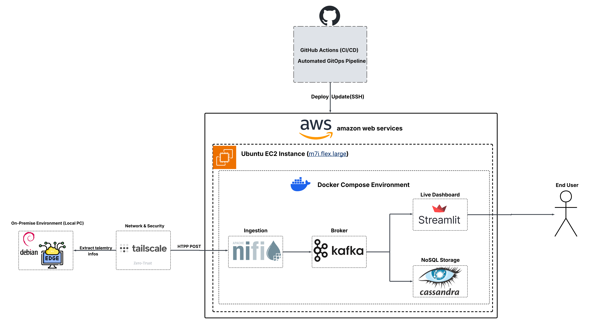

# 👋 Hi, I'm Aboubakr Tahir

### **I write code to move, clean, and store data.**

I am a 4th-year Data & Big Data Engineering student based in Casablanca, Morocco. I specialize in building batch and streaming pipelines, managing cloud infrastructure, and setting up robust ELT/ETL workflows. 

🎯 **Current Objective:** Actively seeking a 2-3 month **PFA Data Engineering Summer Internship (July - Sept 2026)** to tackle real-world DataOps and cloud engineering problems.

---

## 🛠️ The Technical Arsenal

**Cloud & Orchestration**      

**Streaming & Big Data**    

**Languages & Core**      

---

## 🏆 Featured Architectures

### 1. Enterprise Hybrid Cloud ELT Platform
**Tech:** Azure Blob Storage, Snowflake, Apache Airflow, dbt, Docker, Tailscale.
* Built an ELT pipeline migrating on-premise SQL Server data into Snowflake on Azure.
* Set up a Tailscale VPN to pull data securely without opening firewall ports.
* Scheduled jobs using Apache Airflow on Azure Spot Instances for cost optimization.
* Modeled data into a Medallion Architecture star schema using dbt Core.

### 2. Real-Time Edge-to-Cloud IoT Pipeline
**Tech:** AWS (EC2), Apache NiFi, Apache Kafka, Apache Cassandra, Streamlit.
* Engineered a pipeline streaming hardware telemetry from a local Debian node to AWS EC2 over a secure VPN.
* Utilized Apache NiFi for JSON schema validation and routing into an Apache Kafka cluster.
* Wrote a Python consumer to store data in Cassandra and visualize it live via Streamlit.

---

## 💻 The Home Lab
I believe in understanding systems from the bare metal up. To test my data pipelines and deployments locally, I converted an older laptop into a dedicated **Debian Linux home server**. This environment serves as my staging ground for Dockerized orchestration and VPN-secured data routing.

---

## 🚀 Currently Building & Learning
* Refining advanced SQL querying (Window Functions, CTEs) for complex data warehouse modeling.
* Deepening my hands-on deployment experience across major public clouds (AWS/GCP).

---

## 📫 Let's Connect

If you are looking for a DataOps-focused engineering student who understands both the code and the infrastructure, let's talk.

* **LinkedIn:** [linkedin.com/in/aboubakr-tahir](https://www.linkedin.com/in/aboubakr-tahir)
* **Email:** [aboubakrtahir44@gmail.com](mailto:aboubakrtahir44@gmail.com)
* **Resume:** [Click here to view my updated CV](./assets/Tahir_Aboubakr_CV.pdf)

